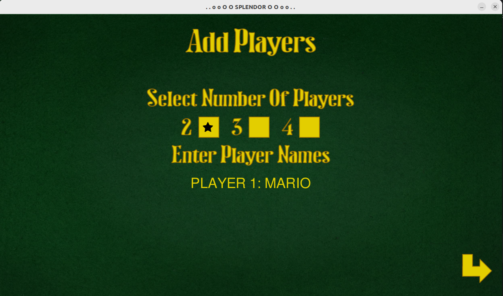

# Splendor

A game based on the Splendor board game.

## General information

The game allows you to play the same way as in the original board game.
We choose the number of players, provide their names and we can start competing.
Currently, the game allows for local competition, but there is a plan to expand it to include online play.
In the game, we can keep player statistics. They are updated after each game played
statistics for each player. The game will be improved and expanded with new functionalities.

## Installation and running

After cloning the repository, install the dependencies:

    pip install -r requirements.txt 

, which will allow the script to run correctly.
To run the game, run the main.py file

To conduct statistics, it is necessary to install the Postgresql database.

## Technologies

Main technologies used to develop the game:

* Python
* Postgresql
* Pygame

## Game description with examples

### Main view

After running the main.py file, a window with the main view will appear (pic.1), where you can choose one of three options:

* Game - switch to the view with adding players
* Statistics - view player statistics
* Quit - exiting the game

    pic.1 Main view

### Add players

In the adding players view, select the number of players from 2 to 4 and enter their names by confirming them with the "ENTER" button.
After providing all the names, you will be taken to the next view.

    pic.2 Add players

### Added players

Before starting the game, a list of players participating in the game is displayed, to start the game, press "START GAME"

    pic.3 Added players

### Game table

After pressing the "Start Game" button in the previous view, the game is prepared, i.e. the cards remain
shuffled and placed on the table and
the number of aristocrat cards and markers is placed depending on the number of players.
The table includes:

* players area (name, points, markers, development cards, reserved development cards, number of aristocrat cards)
* development card area
* tag area
* aristocrat card area
* action button area (take 3 markers of different colors, take 2 markers of the same color, buy a card, reserve
  card)
* exit game button

To perform an action, select and press the button so that it turns yellow and then perform the action.

### Prepared game table

    pic.4 Prepared game table

### Finishing round and game

    pic.5 Finishing round and game

### Results

After finishing the game, a screen with a scoreboard appears, where you can return to the start screen or start
another game with the previously mentioned players

    pic.6 Results view

### Statistics

In the statistics we can check the best 10 players. Here you can check basic data such as:

* number of points scored
* number of games played
* number of cards purchased
* number of admitted aristocrats
* time of the last game played by the player

We have a reset button at our disposal to reset the statistics.

    pic.7 Statistics view

## What's next?

In the future, I would like to expand the game to include online play.
The code requires refactoring and more tests
